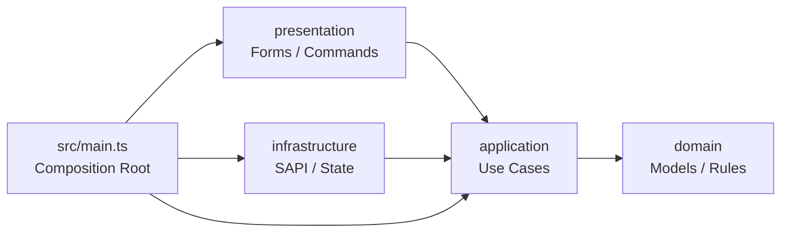

# 架构与恢复不变量

## 依赖方向



- `domain` 只包含可序列化模型、校验、权限和状态转换，不导入 `@minecraft/*`。
- `application` 定义端口并编排用例，不导入 presentation 或 infrastructure。
- `infrastructure` 只实现 application 端口，完整 `ItemStack` 和 SAPI 实体句柄不会越过该边界。
- `presentation` 只映射玩家身份、参数、Forms 输入和输出。
- `src/main.ts` 是唯一实例装配与 SAPI 事件订阅位置。

## 应用服务

| 服务 | 唯一职责 |
|---|---|
| `LifecycleService` | 创建、上下线、重命名、删除、复活及稳定 record revision |
| `InventoryService` | 在线活体/离线快照概览、检查点、41 槽物品/经验事务和 pending 恢复 |
| `BehaviorService` | 即时动作、自动行为配置、寻路优先级仲裁、公平调度和全局方块读取预算 |

三个服务共享 `OperationCoordinator`。写用例按排序后的 `fake:<id>` 和 `player:<playfabId>` 获取 lease；表单等待期间不持有 lease，提交时重新鉴权并检查 record revision。

## 外部端口

| 端口 | 边界 |
|---|---|
| `WorldStateStore` | catalog、permissions、operations 三聚合的版本化读写 |
| `InventorySnapshotStore` | 完整 41 槽结构快照及临时工作区恢复 |
| `InventoryAccess` | 真人与在线假人的槽位、经验、before/after 比较和纯 DTO 概览 |
| `FakePlayerRuntime` | 生成、皮肤、重绑定、断开、复活和真实动作 |
| `WorldQueries` | 区块、方块、距离、视线、玩家和实体查询 |

application 端口只接收稳定 ID、自有坐标、结构 ID、逻辑槽位和判别联合。`Player`、`SimulatedPlayer`、`ItemStack` 等引擎类型只存在于 SAPI infrastructure。

## 持久聚合

每个动态属性聚合使用独立 A/B bank：

1. JSON envelope 包含 `schemaVersion`、`revision`、`checksum` 和 `payload`。
2. checksum 对 `JSON.stringify([schemaVersion, revision, payload])` 的 UTF-8 字节执行 FNV-1a。
3. 提交先检查 UTF-8 容量，再写非活动 bank。
4. 回读、重新解析并验证新 bank 后，只切换 active pointer。
5. active 指向有效 bank 时必须服从指针，不能采用更高 revision 的未提交备用 bank。
6. active 缺失或损坏时才恢复到最高有效 bank，并报告诊断。
7. 部分键存在但两个 bank 都损坏时进入只读隔离，不能用空默认值覆盖世界数据。

当前 schema：catalog 4、permissions 1、operations 2。catalog schema 1/2 在内存迁移，旧记录获得默认行为配置和默认皮肤；既有 schema 3 记录缺少新增的 `place` 行为子配置时，会补为默认关闭状态，只有旧版 `slot` 字段时则迁移为指定槽位模式。schema 1-3 的库存记录会把相邻上一 revision 迁移为强退恢复候选，schema 4 则显式保存并严格校验安全回退 revision。攻击、挖掘、自动交互（放置）和定时使用是互斥动作行为；历史记录若同时启用多项，加载时按攻击、挖掘、自动交互（放置）、定时使用的顺序只保留第一项，再通过正常提交路径持久化。

## 生命周期

稳定状态为 `online`、`offline`、`missing`。可恢复中间状态为 `provisioning`、`snapshotting`、`restoring`、`renaming`、`deleting` 和 `respawning`，每个中间状态携带 operation ID、前态、目标态和 phase。

关键顺序：

- 创建：提交 provisioning，生成并初始化模拟玩家，提交 online。
- 下线：提交 snapshotting，保存并验证新快照，提交 offline 与新 inventory revision，最后断开实体。
- 上线：提交 restoring，生成空实例，恢复已验证快照，提交 online。
- 重命名：在线时先检查点并下线，预留新名称，重新生成并恢复，最后提交稳定状态。
- 默认删除：只允许 offline；先完成全部物品和经验事务，再进入 deleting、删除快照、删除 record。
- 复活：不恢复死亡前快照；先复活，再对复活后的真实背包建立新权威快照，避免与死亡掉落复制。

所有恢复函数必须幂等。未知 SAPI 异常在边界添加操作和稳定 ID 上下文后继续抛出，由命令、Forms、启动恢复或 tick 边界统一记录。

稳定 `online` 和 `offline` 记录都可进入背包管理。在线概览直接读取活体 41 槽；在线写操作先建立即时检查点，再复用与离线操作相同的可恢复事务，并将已验证的 after image 写回活体。在线库存变更标记为 dirty 后优先建立检查点；周期调度每 2 tick 错峰处理一个假人，在最多 10 个假人的约束下保证每个在线假人每 20 tick 建立一次完整检查点，世界 tick 回退时只重建一次时间基准。Forms 在 `show()` 返回后重新获取授权和当前 record revision，不能提交打开表单前缓存的 revision。

## 41 槽快照

逻辑布局只有一份：

| 逻辑槽 | 结构槽 |
|---|---|
| 库存 0-26 | 木桶 A 0-26 |
| 库存 27-35 | 木桶 B 0-8 |
| 头、胸、腿、脚 36-39 | 木桶 B 9-12 |
| 副手 40 | 木桶 B 13 |

主手只由 `selectedSlotIndex` 指向库存槽，不重复保存。完整 `ItemStack` 通过世界结构保存，application 和 domain 从不手工序列化物品组件。

临时工作区必须先保存原方块结构并写 operations 日志，之后才能放置木桶。新快照通过重新加载并逐槽比较后才可成为 catalog 权威 revision，最后恢复原方块并清理工作区。周期检查点保留当前和上一代两个已验证快照；启动时若当前快照因进程强退未落盘，只允许回退到 catalog 明确登记且仍存在的上一代快照，并立即清空检查点时间基准以便补拍。物品转移和死亡复活会清除旧回退代，禁止跨所有权变化或死亡掉落回退。

## 物品事务

物品事务按以下 phase 推进：

```text
prepared -> staged -> applying -> committed -> checkpointed
```

- `prepared` 固定假人 ID/revision、真人 PlayFab ID、请求和 before/after 结构 ID。
- `staged` 表示完整 before 与 expected after image 均已保存并验证。
- `applying` 只在当前真实状态完整等于 before 时写 after；每次写后逐槽回读。
- online 事务把真人和活体假人都视为参与者；假人当前状态必须完整等于 before 或 after，写入 after 后必须逐槽或按绝对经验值回读验证。
- 当前状态完整等于 after 时直接继续提交，不能重复移动物品。
- mixed/conflict 绝不自动覆盖；事务和两份 image 保留供 OP 诊断和沿同一状态机重试。
- `committed` 先让 catalog 指向新的假人快照。
- `checkpointed` 后才可清理旧快照和事务 image。
- 任一物品或经验事务 pending 时，该假人的周期检查点与自动行为都不参与调度。

经验事务保存双方 before 总经验和转移量，以绝对总经验比较并恢复；`addExperience` 按 SAPI 单次上限 16,777,216 分块调用。当前值既非 before 也非 after 时进入 conflict，不能重复累加猜测。

## 启动恢复

系统在 `RecoveryRunner` 完成前保持 `recovering`，失败后进入 `blocked`：

1. 加载并校验 catalog、permissions、operations。
2. 恢复结构临时工作区。
3. 扫描 `xiaobo_fp_<id>` 标签并重绑定运行时句柄；孤立或重复稳定 ID 阻塞恢复。
4. 对存在 pending 事务的 `online` 记录确认活体仍在；实体缺失时按 catalog 权威快照重建并恢复。
5. 恢复 pending 物品和经验事务。
6. 重新加载 catalog/operations，并验证每个残留事务仍指向存在的 `offline` 假人，或有存活实例的 `online` 假人。
7. 按稳定 ID 顺序恢复生命周期中间状态和期望在线记录。
8. 成功后启动检查点和自动行为调度。

`mixed/conflict` 可以作为可诊断 pending 保留。对应假人必须保持 `offline`，或保持具有存活实例的 `online`；后者在 pending 清除前暂停周期检查点和自动行为。其他生命周期组合会阻止 ready。

## 能力门控

`domain/capabilities.ts` 是用户可见能力的单一数据源。状态分为：

- `enabled`：代码路径已实现；标记 `bedrock_26_33_required` 的项目仍需实机发布验收。
- `hidden_pending_game_validation`：精确类型或概念存在，但 Forms 和命令默认不注册入口。
- `unsupported`：公开 API 没有可靠等价，不提供反射、固定延时或命令伪装。

Persona 皮肤只保存 `PlayerSkinData` 公开的部件、手臂尺寸和肤色。经典皮肤纹理不在公开数据中，因此复制请求会明确回退默认皮肤。